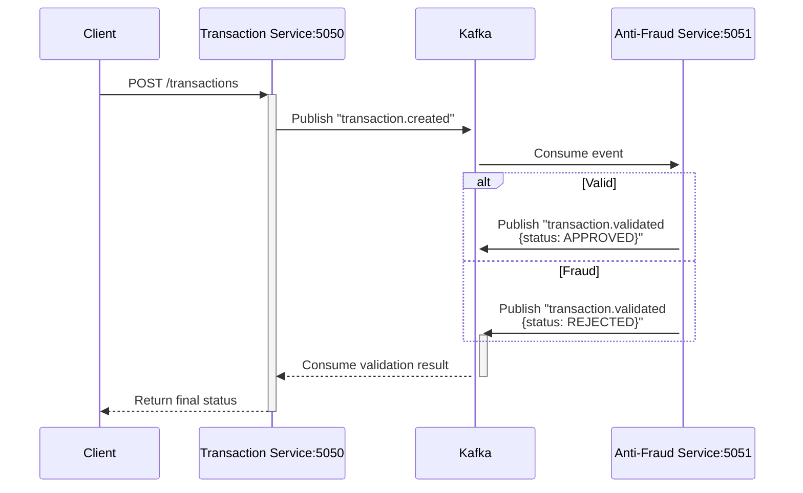

# AntiFraudSystem
AntiFraudSystem is a modular .NET-based solution designed to detect and prevent fraudulent banking transactions. It comprises two primary services: TransactionService for handling transaction processing and AntiFraudService for fraud detection. The system is built with a clean architecture approach, ensuring scalability and maintainability.​

Features
Transaction Processing: Handles the creation and management of banking transactions.

Fraud Detection: Analyzes transactions to identify potential fraudulent activities.

Modular Architecture: Separation of concerns with distinct layers for API, Application, Domain, and Infrastructure.

Dockerized Deployment: Includes Docker Compose configuration for easy setup and deployment
## 🌐 Architecture

### Core Components
| Service               | Port  | Description                     |
|-----------------------|-------|---------------------------------|
| Transaction Service   | 5050  | Processes financial transactions|
| Anti-Fraud Service    | 5051  | Validates transaction legitimacy|

## 🔄 Transaction Validation Flow



## ▶️ Running the System
```bash
docker-compose up -d
```
